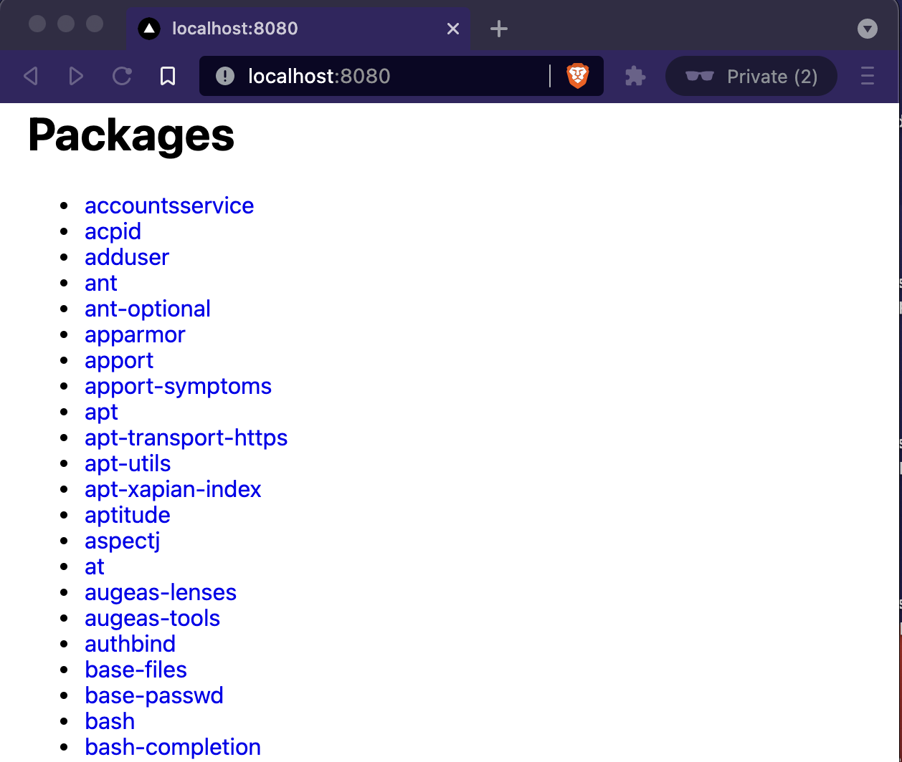
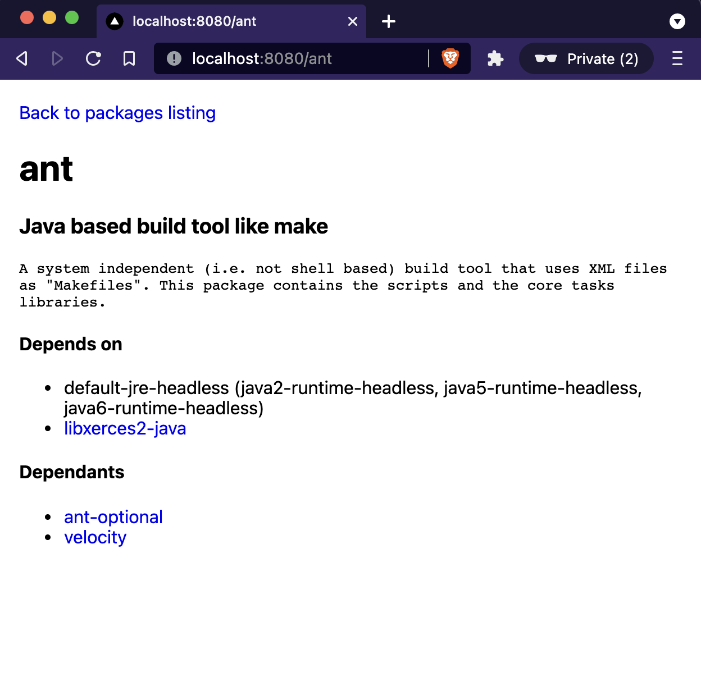

# Packages file parser

The application parses and displays details about software packages in Debian control file (see example file [./status.real](./status.real)). Implemented using [nextjs](https://nextjs.org/).




Main components:

- [./parser/parser.ts](./parser/parser.ts): responsible for parsing the control file
- [./pages/index.tsx](./pages/index.tsx): renders package listing
- [./pages/[pkg].tsx](./pages/[pkg].tsx): renders details about a single package

Pages are rendered on the server side. Data fetching is done by `getServerSideProps` functions found in each page component.

## Development

Tested with node v14.17.6 (LTS).

#### Install dependencies

```
npm i
```

#### Run the dev server

```
npm run dev
```

#### Start up the prod build

```
npm run build
npm run start
```

The app runs on http://localhost:8080.

File path for the packages file can be configured usin `PACKAGES_FILE` env variable, e.g. `PACKAGES_FILE=/tmp/packages.txt npm run dev`. By default it reads [./status.real](./status.real).

## Improvements

- Simplify & clean tests for parser, write more comprehensive tests
- Better mapping functions over `Result<T>` to get rid of unnecessary `isFailure()` calls in parser.ts
- Handle comments in the control file
- Add error page instead of throwing exceptions
- Make description required field

## Problem description

On a Debian or an Ubuntu system there is a file called /var/lib/dpkg/status that holds information about software packages that the system knows about. Write a small program that exposes some key information about currently installed packages via a html interface. The program should listen to http requests on port 8080 on localhost and provide the following features:

- The index page lists installed packages alphabetically with package names as links.
- When following each link, you arrive at an information about a single package. The following information should be included:
  - Name
  - Description
  - The names of the packages the current package depends on (skip version numbers)
  - The names of the packages that depend on the current package
- The dependencies and reverse dependencies should be clickable and the user can navigate the package structure by clicking from package to package.
  Some things to keep in mind:
- Minimize the use of external dependencies.
- The goal of the assignment is to view how you solve the problems with the programming language, not how well you use package managers :)
- The main design goal of this program is maintainability.
- Only look at the Depends field. Ignore other fields that works kind of similarly, such as Suggests and Recommends.
- Sometimes there are alternates in a dependency list, separated by the pipe character (|). When rendering such dependencies, render any alternative that maps to a package name that have an entry in the status file as a link and just print the name of the package name for other packages.
- The section Syntax of control files of the Debian Policy Manual applies to the input data.
- A sample input file from https://gist.github.com/lauripiispanen/29735158335170c27297422a22b48caa
